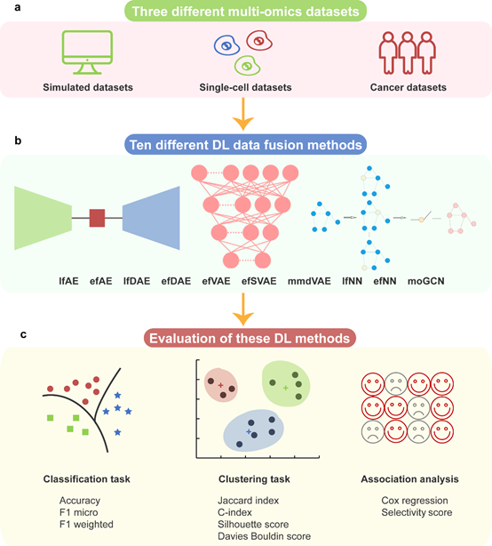

# DL-mo
## A benchmark study of deep learning based multi-omics data fusion methods for cancer
***
  
We here compare the performances of 10 deep learning methods in three contexts: 
1. Simulated datasets
2. Cancer datasets
3. Single-cell datasets       

We use `python` and `R` to code the programs.  The python scripts are in `./python-scripts/` folder .The R scripts are in `./R-scripts/` folder .
***
## 10 deep learning methods
* [lfAE](./python-scripts/runCancerAE2.py)
* [efAE](./python-scripts/runCancerAE.py) 
* [lfDAE](./python-scripts/runCancerDAE2.py) 
* [efDAE](./python-scripts/runCancerDAE.py) 
* [efVAE](./python-scripts/runCancerVAE.py)
* [efSVAE](./python-scripts/runCancerSVAE.py) 
* [mmdVAE](./python-scripts/runCancerMMDVAE.py) 
* [lfNN](./python-scripts/runCancerDNN.py) 
* [efNN](./python-scripts/runCancerDNN.py)
* [moGCN](./python-scripts/MOGONET/main_mogonet_zly.py)
***
## Input data
The data for python scripts is in `./python-scripts/data/` folder .The data for R scripts is in `./R-scripts/data/` folder .    
For python-scripts,Simulated datasets are in `./python-scripts/data/simulations`,Cancer datasets are in `./python-scripts/data/cancer` ,Single-cell datasets are in `./python-scripts/data/single-cell`.
***
## python scripts
Each of the three datasets above corresponds to a differnet python scripts in this repositiory:
1. `runSimulations*.py`
2. `runCancer*.py`
3. `runSingle*.py`
***
## R scripts
Each of the three datasets above corresponds to a differnet Jupyter notebook in this repositiory:
1. `simulated*.ipynb`
2. `cancer*.ipynb`
3. `single-cell*.ipynb`

***
## Install the R software environment
Use conda to create a new environment: `conda create -n momix -c conda-forge -c bioconda -c lcantini momix r-irkernel`
***
## Install the python software environment
You need to build a virtual environment for python.    
You need to install the following main libraries: `Python==3.7.0,Tensorflow==1.15.0, scikit-learn==0.20.0, Jupyter==1.0.0`.

